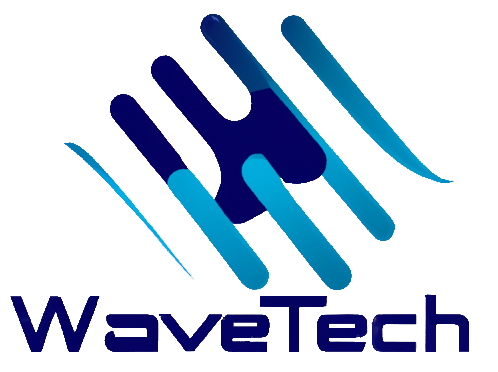

<!-- Improved compatibility of back to top link: See: https://github.com/othneildrew/Best-README-Template/pull/73 -->
<a name="readme-top"></a>
<!--
*** Thanks for checking out the Best-README-Template. If you have a suggestion
*** that would make this better, please fork the repo and create a pull request
*** or simply open an issue with the tag "enhancement".
*** Don't forget to give the project a star!
*** Thanks again! Now go create something AMAZING! :D
-->

<!-- PROJECT SHIELDS -->
<!--
*** I'm using markdown "reference style" links for readability.
*** Reference links are enclosed in brackets [ ] instead of parentheses ( ).
*** See the bottom of this document for the declaration of the reference variables
*** for contributors-url, forks-url, etc. This is an optional, concise syntax you may use.
*** https://www.markdownguide.org/basic-syntax/#reference-style-links
-->
[![Contributors][contributors-shield]][contributors-url]
[![Stargazers][stars-shield]][stars-url]
[![Issues][issues-shield]][issues-url]
[![MIT License][license-shield]][license-url]


<!-- PROJECT LOGO -->
<br />
<div align="center">
  <a href="https://github.com/FabianMaas/TRNG">
    
  </a>

<h3 align="center">True Random Number Generator</h3>

  <p align="center">
    project_description
    <br />
    <a href="https://github.com/FabianMaas/TRNG"><strong>Explore the docs »</strong></a>
    <br />
  </p>
</div>

---

<!-- TABLE OF CONTENTS -->
<details>
  <summary>Table of Contents</summary>
  <ol>
    <li>
      <a href="#about-the-project">About The Project</a>
      <ul>
        <li><a href="#construction_worker_man-built-with">Built With</a></li>
      </ul>
    </li>
    <li>
      <a href="#getting-started">Getting Started</a>
      <ul>
        <li><a href="#pushpin-prerequisites">Prerequisites</a></li>
        <li><a href="#-installation">Installation</a></li>
      </ul>
    </li>
    <li><a href="#usage">Usage</a></li>
    <li><a href="#license">License</a></li>
    <li><a href="#contact">Contact</a></li>
    <li><a href="#acknowledgments">Acknowledgments</a></li>
  </ol>
</details>

---

<!-- ABOUT THE PROJECT -->
## About The Project

[![Product Name Screen Shot][gui-dark]](https://example.com)

Here's a blank template to get started: To avoid retyping too much info. Do a search and replace with your text editor for the following: `github_username`, `repo_name`, `twitter_handle`, `linkedin_username`, `email_client`, `email`, `project_title`, `project_description`

<p align="right">(<a href="#readme-top">back to top</a>)</p>

---

### :construction_worker_man: Built With
* [![Python3][Python]][Python-url]
* [![Flask][Flask]][Flask-url]
* [![SQLite][SQLite]][SQLite-url]
* [![HTML5][HTML5]][HTML5-url]
* [![CSS3][CSS3]][CSS3-url]
* [![JavaScript][JavaScript]][JavaScript-url]


<p align="right">(<a href="#readme-top">back to top</a>)</p>

---

<!-- GETTING STARTED -->
## Getting Started

This is an example of how you may give instructions on setting up your project locally.
To get a local copy up and running follow these simple example steps.

---

### :pushpin: Prerequisites

This is an example of how to list things you need to use the software and how to install them.
* pip
  ```sh
  pip install --upgrade pip
  ```
---

### ⚡ Installation

1. Clone the repo
   ```sh
   git clone https://github.com/FabianMaas/TRNG.git
   ```
2. Switch into the directory
   ```sh
   cd TRNG
   ```
3. Install PIP packages
   ```sh
   pip install -r requirements.txt
   ```

<p align="right">(<a href="#readme-top">back to top</a>)</p>

---

<!-- USAGE EXAMPLES -->
## Usage

Use this space to show useful examples of how a project can be used. Additional screenshots, code examples and demos work well in this space. You may also link to more resources.

_For more examples, please refer to the [Documentation](https://example.com)_

<p align="right">(<a href="#readme-top">back to top</a>)</p>

---

## 📸 **Screenshots**

---

## 🌲 **Project tree**

```text
TRNG
├── LICENSE
├── README.md
├── app.py
├── instance
│   └── TRNG.db
├── lasersensor.py
├── models.py
├── requirements.txt
├── static
│   ├── css
│   │   └── main.css
│   ├── img
│   │   ├── galton.gif
│   │   ├── github-mark-white.png
│   │   ├── github-mark.png
│   │   ├── logo.png
│   │   └── spinner.gif
│   └── js
│       ├── background.js
│       └── main.js
├── templates
│   └── index.html
└── test_suite.py

7 directories, 17 files
```
---

## [Building instructions](https://github.com/FabianMaas/TRNG/blob/dev/docs/models/Building_instructions.md)

---

<!-- LICENSE -->
## License

Distributed under the MIT License. See `LICENSE.txt` for more information.

<p align="right">(<a href="#readme-top">back to top</a>)</p>


<!-- CONTACT -->
## Contact

Your Name - [@twitter_handle](https://twitter.com/twitter_handle) - email@email_client.com

Project Link: [https://github.com/github_username/repo_name](https://github.com/github_username/repo_name)

<p align="right">(<a href="#readme-top">back to top</a>)</p>


<!-- ACKNOWLEDGMENTS -->
## Acknowledgments

* []()
* []()
* []()

<p align="right">(<a href="#readme-top">back to top</a>)</p>


<!-- MARKDOWN LINKS & IMAGES -->
<!-- https://www.markdownguide.org/basic-syntax/#reference-style-links -->
[contributors-shield]: https://img.shields.io/github/contributors/FabianMaas/TRNG.svg?style=for-the-badge
[contributors-url]: https://github.com/FabianMaas/TRNG/graphs/contributors
[stars-shield]: https://img.shields.io/github/stars/FabianMaas/TRNG.svg?style=for-the-badge
[stars-url]: https://github.com/FabianMaas/TRNG/stargazers
[issues-shield]: https://img.shields.io/github/issues/FabianMaas/TRNG.svg?style=for-the-badge
[issues-url]: https://github.com/FabianMaas/TRNG/issues
[license-shield]: https://img.shields.io/github/license/FabianMaas/TRNG.svg?style=for-the-badge
[license-url]: https://github.com/FabianMaas/TRNG/blob/master/LICENSE
[gui-light]: static/img/gui_light.png
[gui-dark]: static/img/gui_dark.png
[Python]: https://img.shields.io/badge/python-3670A0?style=for-the-badge&logo=python&logoColor=ffdd54
[Python-url]: https://www.python.org/
[Flask]: https://img.shields.io/badge/flask-%23000.svg?style=for-the-badge&logo=flask&logoColor=white
[Flask-url]: https://flask.palletsprojects.com
[SQLite]: https://img.shields.io/badge/sqlite-%2307405e.svg?style=for-the-badge&logo=sqlite&logoColor=white
[SQLite-url]: https://www.sqlite.org
[HTML5]: https://img.shields.io/badge/html5-%23E34F26.svg?style=for-the-badge&logo=html5&logoColor=white
[HTML5-url]: https://www.w3.org/standards/webdesign/htmlcss
[CSS3]: https://img.shields.io/badge/css3-%231572B6.svg?style=for-the-badge&logo=css3&logoColor=white
[CSS3-url]: https://www.w3.org/standards/webdesign/htmlcss
[JavaScript]: https://img.shields.io/badge/javascript-%23323330.svg?style=for-the-badge&logo=javascript&logoColor=%23F7DF1E
[JavaScript-url]: https://www.ecma-international.org/publications-and-standards/standards/ecma-262/
